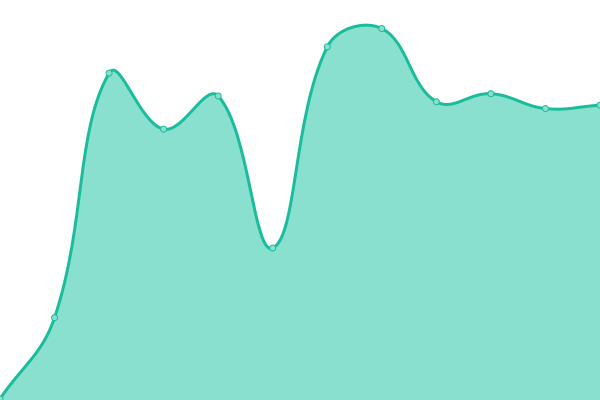

# [📈 Live Status](https://status.e-valuados.com): <!--live status--> **🟧 Partial outage**

This repository contains the open-source uptime monitor and status page for [matiasmir](https://status.e-valuados.com), powered by [Upptime](https://github.com/upptime/upptime).

With [Upptime](https://upptime.js.org), you can get your own unlimited and free uptime monitor and status page, powered entirely by a GitHub repository. We use [Issues](https://github.com/matiasmir/status/issues) as incident reports, [Actions](https://github.com/matiasmir/status/actions) as uptime monitors, and [Pages](https://status.e-valuados.com) for the status page.

<!--start: status pages-->
<!-- This summary is generated by Upptime (https://github.com/upptime/upptime) -->
<!-- Do not edit this manually, your changes will be overwritten -->
<!-- prettier-ignore -->
| URL | Status | History | Response Time | Uptime |
| --- | ------ | ------- | ------------- | ------ |
|  [API Evaluados](https://api.e-valuados.com/v1/health) | 🟩 Up | [api-evaluados.yml](https://github.com/matiasmir/status/commits/HEAD/history/api-evaluados.yml) | 

 126ms
     
 | 

<a href="https://status.e-valuados.com/history/api-evaluados">100.00%</a>
    

|  [API Test Evaluados](https://api.test.e-valuados.com/v1/health) | 🟥 Down | [api-test-evaluados.yml](https://github.com/matiasmir/status/commits/HEAD/history/api-test-evaluados.yml) | 

 117ms
     
 | 

<a href="https://status.e-valuados.com/history/api-test-evaluados">0.00%</a>
    

|  [Gestor UPAEP](https://upaep.e-valuados.com) | 🟥 Down | [gestor-upaep.yml](https://github.com/matiasmir/status/commits/HEAD/history/gestor-upaep.yml) | 

 115ms
     
 | 

<a href="https://status.e-valuados.com/history/gestor-upaep">0.00%</a>
    

|  [Gestor Continental](https://continental.e-valuados.com) | 🟩 Up | [gestor-continental.yml](https://github.com/matiasmir/status/commits/HEAD/history/gestor-continental.yml) | 

 99ms
     
 | 

<a href="https://status.e-valuados.com/history/gestor-continental">100.00%</a>
    

|  [Gestor Applicados21](https://applicados21.e-valuados.com) | 🟥 Down | [gestor-applicados21.yml](https://github.com/matiasmir/status/commits/HEAD/history/gestor-applicados21.yml) | 

 91ms
     
 | 

<a href="https://status.e-valuados.com/history/gestor-applicados21">0.00%</a>
    

|  [Gestor Evaluados](https://docente.e-valuados.com) | 🟥 Down | [gestor-evaluados.yml](https://github.com/matiasmir/status/commits/HEAD/history/gestor-evaluados.yml) | 

 92ms
     
 | 

<a href="https://status.e-valuados.com/history/gestor-evaluados">0.00%</a>
    

|  [Gestor UTE](https://ute.e-valuados.com) | 🟥 Down | [gestor-ute.yml](https://github.com/matiasmir/status/commits/HEAD/history/gestor-ute.yml) | 

 105ms
     
 | 

<a href="https://status.e-valuados.com/history/gestor-ute">0.00%</a>
    

<!--end: status pages-->

[**Visit our status website →**](https://status.e-valuados.com)

## 📄 License

- Powered by: [Upptime](https://github.com/upptime/upptime)
- Code: [MIT](./LICENSE) © [matiasmir](https://status.e-valuados.com)
- Data in the `./history` directory: [Open Database License](https://opendatacommons.org/licenses/odbl/1-0/)
